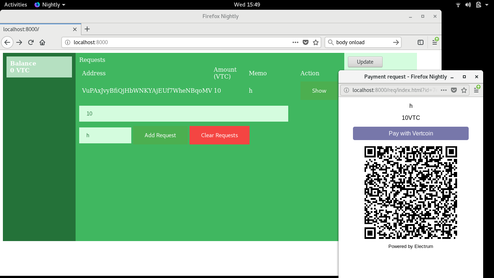

Really basic example

JQuery to access electrum-vtc RPC



Start like so

Make sure to backup your wallets from ~/.electrum-vtc

```
mkdir wallet
electrum-vtc create
electrum-vtc setconfig url_rewrite "['file:///`pwd`/wallet/', 'http://localhost:8000/']"
electrum-vtc setconfig requests_dir `pwd`/wallet/req
electrum-vtc daemon start
electrum-vtc load_wallet
cd wallet
python -m SimpleHTTPServer
```
